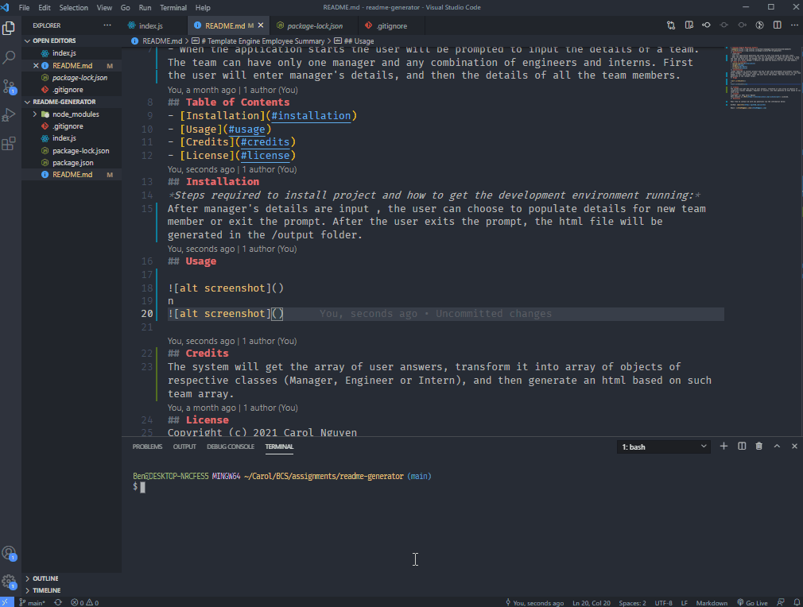

# ReadME Generator

## Description
- To generate ReadMe using node application

## Table of Contents
- [Installation](#installation)
- [Usage](#usage)
- [Credits](#credits)
- [License](#license)
## Installation
*Steps required to install project and how to get the development environment running:*
node
## Usage

## License
Copyright (c) 2021 Carol Nguyen
This project is [MIT](https://choosealicense.com/licenses/mit/) Licensed.
## Questions

Feel free to contact me with any questions via the information below:

GitHub: [@caroltn](https://github.com/caroltn)

Email: [cthoa01@gmail.com](cthoa01@gmail.com)
